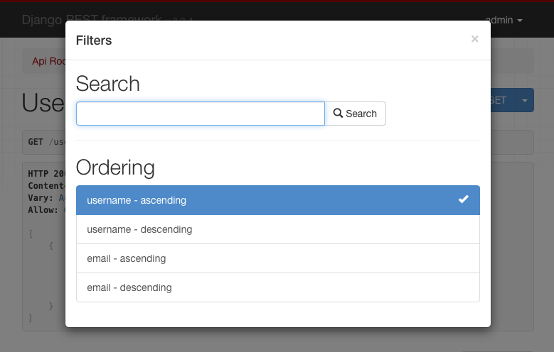
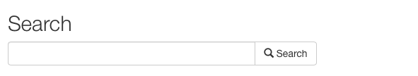
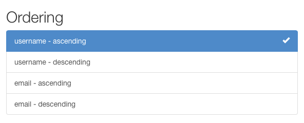

---
source:
    - filters.py
---

# Filtering

> Manager가 제공하는 루트 QuerySet은 데이터베이스 테이블에 존재하는 **모든 객체**를 나타냅니다. 하지만 대부분의 경우, 전체 객체 집합이 아닌 **일부만 선택**해야 합니다.
>
> &mdash; [Django documentation][cite]

REST framework의 generic list view의 기본 동작은 모델 매니저가 제공하는 **전체 queryset**을 반환하는 것입니다.  
하지만 실제로는 API가 반환하는 항목을 **특정 조건에 따라 제한**하고 싶은 경우가 많습니다.

`GenericAPIView` 를 상속하는 모든 뷰에서 queryset을 필터링하는 가장 간단한 방법은  
`.get_queryset()` 메서드를 오버라이드하는 것입니다.

이 메서드를 오버라이드하면, 뷰가 반환하는 queryset을 다양한 방식으로 커스터마이징할 수 있습니다.

## Filtering against the current user

현재 요청을 보낸 **인증된 사용자와 관련된 결과만 반환**하고 싶을 수 있습니다.

이 경우 `request.user` 값을 기준으로 queryset을 필터링할 수 있습니다.

예를 들어:

    from myapp.models import Purchase
    from myapp.serializers import PurchaseSerializer
    from rest_framework import generics

    class PurchaseList(generics.ListAPIView):
        serializer_class = PurchaseSerializer

        def get_queryset(self):
            """
            이 뷰는 현재 인증된 사용자의
            모든 구매 내역을 반환해야 한다.
            """
            user = self.request.user
            return Purchase.objects.filter(purchaser=user)

## Filtering against the URL

URL의 일부 값을 기준으로 queryset을 제한하는 방식도 사용할 수 있습니다.

예를 들어 URL 설정에 다음과 같은 항목이 있다면:

    re_path('^purchases/(?P<username>.+)/$', PurchaseList.as_view()),

URL에 포함된 `username` 값을 기준으로 queryset을 필터링하는 뷰를 작성할 수 있습니다.

    class PurchaseList(generics.ListAPIView):
        serializer_class = PurchaseSerializer

        def get_queryset(self):
            """
            이 뷰는 URL의 username 값으로 결정된
            사용자의 모든 구매 내역을 반환해야 한다.
            """
            username = self.kwargs['username']
            return Purchase.objects.filter(purchaser__username=username)

## Filtering against query parameters

마지막 예시는 URL의 **query parameter**를 기준으로 초기 queryset을 결정하는 방식입니다.

`.get_queryset()` 을 오버라이드하여  
`http://example.com/api/purchases?username=denvercoder9` 와 같은 URL을 처리할 수 있습니다.

`username` 파라미터가 존재하는 경우에만 queryset을 필터링합니다.

    class PurchaseList(generics.ListAPIView):
        serializer_class = PurchaseSerializer

        def get_queryset(self):
            """
            URL의 `username` query parameter를 기준으로
            특정 사용자의 구매 내역만 반환하도록 제한한다.
            """
            queryset = Purchase.objects.all()
            username = self.request.query_params.get('username')
            if username is not None:
                queryset = queryset.filter(purchaser__username=username)
            return queryset

---

# Generic Filtering

기본 queryset을 오버라이드하는 것 외에도,  
REST framework는 **generic filtering backend** 를 지원하여  
복잡한 검색 및 필터링을 쉽게 구성할 수 있도록 합니다.

Generic filter는 **Browsable API** 및 **Admin API** 에서  
HTML 컨트롤 형태로 표시될 수도 있습니다.

## Setting filter backends

기본 filter backend는 `DEFAULT_FILTER_BACKENDS` 설정을 통해 전역으로 지정할 수 있습니다.

예를 들어:

    REST_FRAMEWORK = {
        'DEFAULT_FILTER_BACKENDS': ['django_filters.rest_framework.DjangoFilterBackend']
    }

또는 `GenericAPIView` 기반의 뷰나 뷰셋 단위로 filter backend를 지정할 수도 있습니다.

    import django_filters.rest_framework
    from django.contrib.auth.models import User
    from myapp.serializers import UserSerializer
    from rest_framework import generics

    class UserListView(generics.ListAPIView):
        queryset = User.objects.all()
        serializer_class = UserSerializer
        filter_backends = [django_filters.rest_framework.DjangoFilterBackend]

## Filtering and object lookups

뷰에 filter backend가 설정되어 있으면,  
리스트 뷰뿐만 아니라 **단일 객체 조회 시에도 동일한 필터링 조건이 적용**됩니다.

예를 들어, 이전 예제에서 ID가 `4675` 인 상품이 있을 때,  
다음 URL은 필터 조건을 만족하면 객체를 반환하고,  
만족하지 않으면 404 응답을 반환합니다.

    http://example.com/api/products/4675/?category=clothing&max_price=10.00

## Overriding the initial queryset

`.get_queryset()` 오버라이드와 generic filtering은 **함께 사용 가능**하며,  
예상한 대로 정상 동작합니다.

예를 들어 `Product` 가 `User` 와 `purchase` 라는 many-to-many 관계를 가지고 있다면,  
다음과 같은 뷰를 작성할 수 있습니다.

    class PurchasedProductsList(generics.ListAPIView):
        """
        인증된 사용자가 지금까지 구매한
        모든 상품 목록을 (선택적 필터링과 함께) 반환한다.
        """
        model = Product
        serializer_class = ProductSerializer
        filterset_class = ProductFilter

        def get_queryset(self):
            user = self.request.user
            return user.purchase_set.all()

---

# API Guide

## DjangoFilterBackend

[`django-filter`][django-filter-docs] 라이브러리는  
REST framework에서 **고도로 커스터마이징 가능한 필드 기반 필터링**을 지원하는  
`DjangoFilterBackend` 클래스를 제공합니다.

`DjangoFilterBackend` 를 사용하려면 먼저 `django-filter` 를 설치해야 합니다.

    pip install django-filter

그 다음 Django의 `INSTALLED_APPS` 에 `'django_filters'` 를 추가합니다.

    INSTALLED_APPS = [
        ...
        'django_filters',
        ...
    ]

이제 filter backend를 전역 설정에 추가하거나,

    REST_FRAMEWORK = {
        'DEFAULT_FILTER_BACKENDS': ['django_filters.rest_framework.DjangoFilterBackend']
    }

개별 View 또는 ViewSet에 직접 추가할 수 있습니다.

    from django_filters.rest_framework import DjangoFilterBackend

    class UserListView(generics.ListAPIView):
        ...
        filter_backends = [DjangoFilterBackend]

단순한 **동등 비교(equality-based)** 필터링만 필요하다면,  
뷰 또는 뷰셋에 `filterset_fields` 속성을 지정하면 됩니다.

    class ProductList(generics.ListAPIView):
        queryset = Product.objects.all()
        serializer_class = ProductSerializer
        filter_backends = [DjangoFilterBackend]
        filterset_fields = ['category', 'in_stock']

이렇게 하면 지정된 필드를 기준으로 자동으로 `FilterSet` 클래스가 생성되며,  
다음과 같은 요청이 가능해집니다.

    http://example.com/api/products?category=clothing&in_stock=True

더 복잡한 필터링이 필요하다면,  
뷰에서 사용할 `FilterSet` 클래스를 직접 지정할 수 있습니다.

자세한 내용은 [django-filter 문서][django-filter-docs]와  
[DRF 통합 가이드][django-filter-drf-docs]를 참고하세요.

## SearchFilter

`SearchFilter` 클래스는 **단일 query parameter 기반 검색**을 지원하며,  
[Django admin의 검색 기능][search-django-admin]을 기반으로 합니다.

사용 시, Browsable API에 `SearchFilter` 컨트롤이 표시됩니다.

`SearchFilter` 는 뷰에 `search_fields` 속성이 설정된 경우에만 적용됩니다.  
`search_fields` 는 모델의 `CharField`, `TextField` 와 같은  
텍스트 필드 이름들의 리스트여야 합니다.

    from rest_framework import filters

    class UserListView(generics.ListAPIView):
        queryset = User.objects.all()
        serializer_class = UserSerializer
        filter_backends = [filters.SearchFilter]
        search_fields = ['username', 'email']

이렇게 하면 다음과 같은 요청으로 필터링할 수 있습니다.

    http://example.com/api/users?search=russell

ForeignKey 또는 ManyToManyField에 대해서도  
double-underscore(`__`) 표기법을 사용한 관련 조회가 가능합니다.

    search_fields = ['username', 'email', 'profile__profession']

[JSONField][JSONField] 및 [HStoreField][HStoreField] 의 경우에도  
동일한 표기법을 사용하여 중첩된 값으로 필터링할 수 있습니다.

    search_fields = ['data__breed', 'data__owner__other_pets__0__name']

기본적으로 검색은 **대소문자를 구분하지 않는 부분 일치**를 사용합니다.  
검색 파라미터는 공백 또는 쉼표로 구분된 여러 검색어를 포함할 수 있으며,  
모든 검색어가 일치하는 객체만 결과에 포함됩니다.

공백이 포함된 _인용 구문(quoted phrase)_ 도 지원되며,  
각 구문은 하나의 검색어로 취급됩니다.

검색 동작은 `search_fields` 에 접두어를 붙여 제어할 수 있습니다  
(이는 필드에 `__<lookup>` 을 추가하는 것과 동일합니다).

| Prefix | Lookup        | 설명 |
| ------ | --------------| ------------------ |
| `^`    | `istartswith` | 시작 문자열 검색 |
| `=`    | `iexact`      | 정확히 일치 |
| `$`    | `iregex`      | 정규식 검색 |
| `@`    | `search`      | 전문 검색 (현재 Django [PostgreSQL backend][postgres-search]만 지원) |
| 없음   | `icontains`   | 부분 포함 검색 (기본값) |

예시:

    search_fields = ['=username', '=email']

기본 검색 파라미터 이름은 `'search'` 이지만,  
`REST_FRAMEWORK` 설정의 `SEARCH_PARAM` 으로 변경할 수 있습니다.

요청 내용에 따라 동적으로 검색 필드를 변경하려면,  
`SearchFilter` 를 상속하고 `get_search_fields()` 메서드를 오버라이드하면 됩니다.

다음 예제는 `title_only` 파라미터가 있을 경우에만 `title` 필드로 검색합니다.

    from rest_framework import filters

    class CustomSearchFilter(filters.SearchFilter):
        def get_search_fields(self, view, request):
            if request.query_params.get('title_only'):
                return ['title']
            return super().get_search_fields(view, request)

자세한 내용은 [Django 문서][search-django-admin]를 참고하세요.

---

## OrderingFilter

`OrderingFilter` 클래스는 query parameter를 통해  
결과 정렬을 제어할 수 있도록 지원합니다.

기본 query parameter 이름은 `'ordering'` 이며,  
`REST_FRAMEWORK` 설정의 `ORDERING_PARAM` 으로 변경할 수 있습니다.

예를 들어 username 기준 정렬:

    http://example.com/api/users?ordering=username

역순 정렬은 필드 이름 앞에 `-` 를 붙입니다.

    http://example.com/api/users?ordering=-username

여러 필드를 동시에 지정할 수도 있습니다.

    http://example.com/api/users?ordering=account,username

### Specifying which fields may be ordered against

정렬 가능한 필드는 **명시적으로 지정하는 것을 권장**합니다.

    class UserListView(generics.ListAPIView):
        queryset = User.objects.all()
        serializer_class = UserSerializer
        filter_backends = [filters.OrderingFilter]
        ordering_fields = ['username', 'email']

이는 비밀번호 해시 등 **민감한 필드로 정렬되는 것을 방지**하는 데 도움이 됩니다.

`ordering_fields` 를 지정하지 않으면,  
serializer에서 읽기 가능한 모든 필드가 정렬 대상으로 허용됩니다.

쿼리셋에 민감한 데이터가 없다고 확신할 수 있다면,  
특수 값 `'__all__'` 을 사용해 모든 필드 정렬을 허용할 수도 있습니다.

    class BookingsListView(generics.ListAPIView):
        queryset = Booking.objects.all()
        serializer_class = BookingSerializer
        filter_backends = [filters.OrderingFilter]
        ordering_fields = '__all__'

### Specifying a default ordering

뷰에 `ordering` 속성이 설정되어 있으면 기본 정렬로 사용됩니다.

    class UserListView(generics.ListAPIView):
        queryset = User.objects.all()
        serializer_class = UserSerializer
        filter_backends = [filters.OrderingFilter]
        ordering_fields = ['username', 'email']
        ordering = ['username']

`ordering` 은 문자열 또는 문자열 리스트/튜플이 될 수 있습니다.

---

# Custom generic filtering

직접 generic filtering backend를 구현하거나,  
다른 개발자가 사용할 수 있는 설치형 앱으로 제공할 수도 있습니다.

이를 위해 `BaseFilterBackend` 를 상속하고  
`.filter_queryset(self, request, queryset, view)` 메서드를 구현합니다.

이 메서드는 **새로운 필터링된 queryset** 을 반환해야 합니다.

Generic filter backend는 검색/필터링뿐 아니라,  
**요청이나 사용자별로 노출 가능한 객체를 제한**하는 데에도 유용합니다.

## Example

예를 들어, 사용자가 자신이 생성한 객체만 볼 수 있도록 제한할 수 있습니다.

    class IsOwnerFilterBackend(filters.BaseFilterBackend):
        """
        사용자가 자신의 객체만 볼 수 있도록 제한하는 필터
        """
        def filter_queryset(self, request, queryset, view):
            return queryset.filter(owner=request.user)

같은 동작을 `get_queryset()` 오버라이드로도 구현할 수 있지만,  
filter backend를 사용하면 여러 뷰에 쉽게 재사용하거나  
API 전체에 일괄 적용할 수 있습니다.

## Customizing the interface

Generic filter는 Browsable API에서 인터페이스를 제공할 수도 있습니다.  
이를 위해 `to_html()` 메서드를 구현해야 합니다.

메서드 시그니처는 다음과 같습니다.

`to_html(self, request, queryset, view)`

이 메서드는 렌더링된 HTML 문자열을 반환해야 합니다.

# Third party packages

다음은 추가적인 필터 구현을 제공하는 서드파티 패키지들입니다.

## Django REST framework filters package

[django-rest-framework-filters][django-rest-framework-filters] 패키지는  
`DjangoFilterBackend` 와 함께 동작하며,  
관계 필터링이나 하나의 필드에 대해 여러 lookup 타입을 쉽게 정의할 수 있게 해줍니다.

## Django REST framework full word search filter

[django-rest-framework-word-filter][django-rest-framework-word-search-filter] 는  
`filters.SearchFilter` 의 대안으로 개발되었으며,  
텍스트에 대한 **전체 단어 검색** 또는 **정확한 일치 검색**을 지원합니다.

## Django URL Filter

[django-url-filter][django-url-filter] 는 사람이 읽기 쉬운 URL을 통해  
안전하게 데이터를 필터링할 수 있는 방법을 제공합니다.  
DRF serializer와 유사한 개념으로 filterset과 filter를 사용하며,  
중첩 필터링도 지원합니다.  
또한 Django `QuerySet` 뿐만 아니라 다른 데이터 소스에도 사용할 수 있는  
범용 라이브러리입니다.

## drf-url-filters

[drf-url-filter][drf-url-filter] 는  
DRF `ModelViewSet` 의 `Queryset` 에 필터를 적용하기 위한  
간단하고 깔끔하며 설정 가능한 Django 앱입니다.

요청 query parameter 및 값에 대한 validation도 지원하며,  
검증에는 `Voluptuous` 파이썬 패키지를 사용합니다.  
Voluptuous의 가장 큰 장점은  
query parameter 요구사항에 맞는 **커스텀 검증 로직을 직접 정의할 수 있다는 점**입니다.

[cite]: https://docs.djangoproject.com/en/stable/topics/db/queries/#retrieving-specific-objects-with-filters
[django-filter-docs]: https://django-filter.readthedocs.io/en/latest/index.html
[django-filter-drf-docs]: https://django-filter.readthedocs.io/en/latest/guide/rest_framework.html
[search-django-admin]: https://docs.djangoproject.com/en/stable/ref/contrib/admin/#django.contrib.admin.ModelAdmin.search_fields
[django-rest-framework-filters]: https://github.com/philipn/django-rest-framework-filters
[django-rest-framework-word-search-filter]: https://github.com/trollknurr/django-rest-framework-word-search-filter
[django-url-filter]: https://github.com/miki725/django-url-filter
[drf-url-filter]: https://github.com/manjitkumar/drf-url-filters
[HStoreField]: https://docs.djangoproject.com/en/stable/ref/contrib/postgres/fields/#hstorefield
[JSONField]: https://docs.djangoproject.com/en/stable/ref/models/fields/#django.db.models.JSONField
[postgres-search]: https://docs.djangoproject.com/en/stable/ref/contrib/postgres/search/
