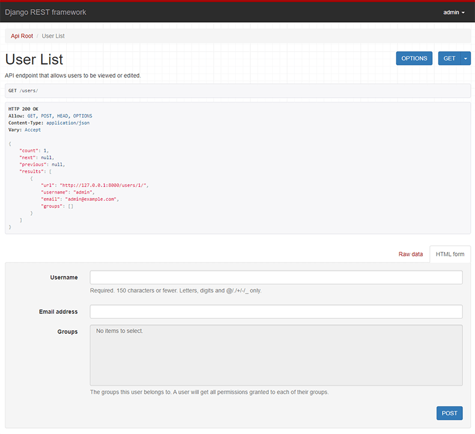
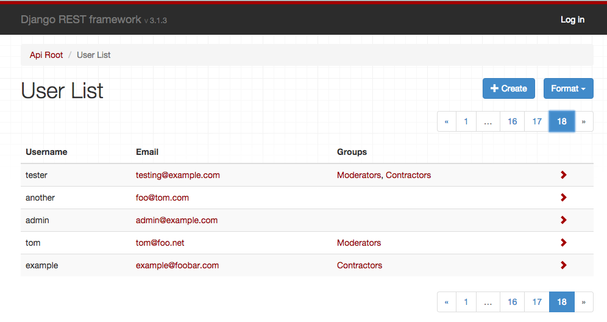

---
source:
    - renderers.py
---

# 렌더러 (Renderers)

> TemplateResponse 인스턴스를 클라이언트에 반환하기 전에, 반드시 렌더링되어야 한다. 렌더링 과정은 템플릿과 컨텍스트의 중간 표현(intermediate representation)을 최종 바이트 스트림으로 변환하여 클라이언트에 제공할 수 있게 만든다.
>
> &mdash; [Django documentation][cite]

REST framework는 다양한 미디어 타입으로 응답을 반환할 수 있도록 여러 **내장 Renderer 클래스**를 제공한다.  
또한 **커스텀 렌더러**를 직접 정의할 수도 있어, 원하는 미디어 타입을 설계하는 데 유연성을 제공한다.

## 렌더러가 결정되는 방식

각 뷰에서 유효한 렌더러 집합은 항상 **클래스 리스트**로 정의된다.  
뷰에 진입하면 REST framework는 들어온 요청에 대해 **콘텐츠 협상(content negotiation)** 을 수행하고, 요청을 만족시키기에 가장 적절한 렌더러를 결정한다.

콘텐츠 협상의 기본 과정은 요청의 `Accept` 헤더를 확인하여, 응답에서 기대하는 미디어 타입을 결정하는 것이다.  
또한 URL의 format suffix를 사용해 특정 표현(representation)을 명시적으로 요청할 수도 있다. 예를 들어 `http://example.com/api/users_count.json` 같은 URL은 항상 JSON 데이터를 반환하는 엔드포인트일 수 있다.

자세한 내용은 [content negotiation][conneg] 문서를 참고하라.

## 렌더러 설정하기

기본 렌더러 목록은 `DEFAULT_RENDERER_CLASSES` 설정을 통해 전역으로 지정할 수 있다.  
예를 들어 아래 설정은 기본 미디어 타입으로 `JSON`을 사용하면서, self describing API도 함께 포함한다.

    REST_FRAMEWORK = {
        'DEFAULT_RENDERER_CLASSES': [
            'rest_framework.renderers.JSONRenderer',
            'rest_framework.renderers.BrowsableAPIRenderer',
        ]
    }

또는 개별 뷰/뷰셋 단위로 렌더러를 지정할 수도 있다.  
`APIView` 기반 클래스 뷰에서 사용하는 예시는 다음과 같다.

    from django.contrib.auth.models import User
    from rest_framework.renderers import JSONRenderer
    from rest_framework.response import Response
    from rest_framework.views import APIView

    class UserCountView(APIView):
        """
        활성 사용자 수를 JSON으로 반환하는 뷰.
        """
        renderer_classes = [JSONRenderer]

        def get(self, request, format=None):
            user_count = User.objects.filter(active=True).count()
            content = {'user_count': user_count}
            return Response(content)

함수 기반 뷰에서 `@api_view` 데코레이터를 사용하는 경우에는 다음과 같이 설정할 수 있다.

    @api_view(['GET'])
    @renderer_classes([JSONRenderer])
    def user_count_view(request, format=None):
        """
        활성 사용자 수를 JSON으로 반환하는 뷰.
        """
        user_count = User.objects.filter(active=True).count()
        content = {'user_count': user_count}
        return Response(content)

## 렌더러 클래스의 우선순위(순서)

API에서 렌더러 클래스를 지정할 때는 각 미디어 타입에 어떤 우선순위를 둘지 고려하는 것이 중요하다.  
클라이언트가 받을 수 있는 표현을 충분히 명시하지 않는 경우(예: `Accept: */*` 헤더를 보내거나, `Accept` 헤더를 아예 포함하지 않는 경우) REST framework는 리스트에서 **첫 번째 렌더러**를 선택해 응답을 생성한다.

예를 들어 API가 JSON 응답과 HTML Browsable API를 제공한다면, `Accept` 헤더를 명시하지 않는 클라이언트에게도 JSON을 보내기 위해 `JSONRenderer`를 기본 렌더러로 두는 것이 좋을 수 있다.

만약 하나의 뷰가 요청에 따라 일반 웹페이지와 API 응답을 모두 제공할 수 있다면, [깨진 accept 헤더를 보내는 오래된 브라우저][browser-accept-headers]와의 호환성을 위해 `TemplateHTMLRenderer`를 기본 렌더러로 두는 방안도 고려할 수 있다.

---

# API 레퍼런스

## JSONRenderer

요청 데이터를 utf-8 인코딩을 사용해 `JSON`으로 렌더링한다.

기본 스타일은 유니코드 문자를 그대로 포함하며, 불필요한 공백 없이 compact 스타일로 렌더링한다:

    {"unicode black star":"★","value":999}

클라이언트는 `'indent'` 미디어 타입 파라미터를 추가로 포함할 수 있으며, 이 경우 반환되는 `JSON`은 들여쓰기가 적용된다.  
예: `Accept: application/json; indent=4`.

    {
        "unicode black star": "★",
        "value": 999
    }

기본 JSON 인코딩 스타일은 `UNICODE_JSON` 및 `COMPACT_JSON` 설정 키를 통해 변경할 수 있다.

**.media_type**: `application/json`

**.format**: `'json'`

**.charset**: `None`

## TemplateHTMLRenderer

Django의 표준 템플릿 렌더링을 사용해 데이터를 HTML로 렌더링한다.  
다른 렌더러들과 달리, `Response`에 전달하는 데이터는 반드시 serialize될 필요가 없다.  
또한 `Response` 생성 시 `template_name` 인자를 포함하는 편이 유용할 수 있다.

TemplateHTMLRenderer는 `response.data`를 컨텍스트 딕셔너리로 사용해 `RequestContext`를 만들고, 해당 컨텍스트를 렌더링할 템플릿 이름을 결정한다.

---

**참고:** serializer를 사용하는 뷰와 함께 사용할 때, 렌더링할 `Response`의 `data`가 딕셔너리가 아닐 수 있다.  
이 경우 `TemplateHTMLRenderer`가 렌더링할 수 있도록 반환 전에 dict로 감싸야 한다. 예:

```
response.data = {'results': response.data}
```

---

템플릿 이름은 다음 우선순위로 결정된다:

1. 응답(Response)에 전달된 명시적인 `template_name` 인자
2. 이 클래스에 설정된 명시적인 `.template_name` 속성
3. `view.get_template_names()` 호출 결과

`TemplateHTMLRenderer`를 사용하는 뷰 예시는 다음과 같다:

    class UserDetail(generics.RetrieveAPIView):
        """
        특정 사용자를 템플릿 기반 HTML로 반환하는 뷰.
        """
        queryset = User.objects.all()
        renderer_classes = [TemplateHTMLRenderer]

        def get(self, request, *args, **kwargs):
            self.object = self.get_object()
            return Response({'user': self.object}, template_name='user_detail.html')

`TemplateHTMLRenderer`는 REST framework를 이용해 일반 HTML 페이지를 반환하는 용도로도 사용할 수 있고, 단일 엔드포인트에서 HTML과 API 응답을 모두 제공하는 용도로도 사용할 수 있다.

`TemplateHTMLRenderer`를 다른 렌더러들과 함께 사용해 웹사이트를 만들고 있다면, 브라우저가 잘못된 `ACCEPT:` 헤더를 보내더라도 우선순위가 높도록 `renderer_classes` 리스트의 첫 번째로 두는 것을 고려하라.

`TemplateHTMLRenderer` 사용 예시는 [_HTML & Forms_ Topic Page][html-and-forms]도 참고하라.

**.media_type**: `text/html`

**.format**: `'html'`

**.charset**: `utf-8`

참고: `StaticHTMLRenderer`

## StaticHTMLRenderer

사전 렌더링된 HTML을 그대로 반환하는 간단한 렌더러다.  
다른 렌더러들과 달리, response 객체에 전달되는 데이터는 반환할 콘텐츠를 나타내는 **문자열**이어야 한다.

`StaticHTMLRenderer`를 사용하는 뷰 예시는 다음과 같다:

    @api_view(['GET'])
    @renderer_classes([StaticHTMLRenderer])
    def simple_html_view(request):
        data = '<html><body><h1>Hello, world</h1></body></html>'
        return Response(data)

`StaticHTMLRenderer`는 REST framework로 일반 HTML 페이지를 반환하거나, 단일 엔드포인트에서 HTML과 API 응답을 함께 제공하는 용도로 사용할 수 있다.

**.media_type**: `text/html`

**.format**: `'html'`

**.charset**: `utf-8`

참고: `TemplateHTMLRenderer`

## BrowsableAPIRenderer

Browsable API를 위한 HTML로 데이터를 렌더링한다:



이 렌더러는 다른 렌더러들 중 우선순위가 가장 높은 렌더러(단, `BrowsableAPIRenderer`는 제외)를 결정한 다음, 그 렌더러를 사용해 HTML 페이지 안에서 API 스타일 응답을 표시한다.

**.media_type**: `text/html`

**.format**: `'api'`

**.charset**: `utf-8`

**.template**: `'rest_framework/api.html'`

#### BrowsableAPIRenderer 커스터마이징

기본적으로 응답 콘텐츠는 `BrowsableAPIRenderer`를 제외한 렌더러 중 우선순위가 가장 높은 렌더러로 렌더링된다.  
예를 들어 기본 반환 포맷은 HTML로 두되, browsable API에서는 JSON으로 보이게 하고 싶다면 `get_default_renderer()` 메서드를 오버라이드하여 커스터마이징할 수 있다. 예:

    class CustomBrowsableAPIRenderer(BrowsableAPIRenderer):
        def get_default_renderer(self, view):
            return JSONRenderer()

## AdminRenderer

관리자(admin) 스타일의 표시를 위한 HTML로 데이터를 렌더링한다:



이 렌더러는 CRUD 스타일의 웹 API에서 데이터를 관리하기 위한 사용자 친화적 인터페이스를 함께 제공하고자 할 때 적합하다.

입력용 serializer가 중첩(nested) serializer이거나 리스트 serializer를 포함하는 뷰는 `AdminRenderer`와 잘 맞지 않을 수 있다. HTML 폼이 이를 제대로 지원하기 어렵기 때문이다.

**참고**: `AdminRenderer`는 데이터에 올바르게 설정된 `URL_FIELD_NAME`(기본값 `url`) 속성이 존재할 때만 상세 페이지 링크를 포함할 수 있다.  
`HyperlinkedModelSerializer`에서는 보통 해당 조건이 만족되지만, `ModelSerializer`나 일반 `Serializer`를 사용할 경우에는 필드를 명시적으로 포함해야 한다. 예를 들어 모델의 `get_absolute_url` 메서드를 사용하도록 설정할 수 있다:

    class AccountSerializer(serializers.ModelSerializer):
        url = serializers.CharField(source='get_absolute_url', read_only=True)

        class Meta:
            model = Account

**.media_type**: `text/html`

**.format**: `'admin'`

**.charset**: `utf-8`

**.template**: `'rest_framework/admin.html'`

## HTMLFormRenderer

serializer가 반환한 데이터를 HTML 폼으로 렌더링한다.  
이 렌더러의 출력에는 `<form>` 태그, 숨겨진 CSRF 입력, submit 버튼이 포함되지 않는다.

이 렌더러는 직접 사용하기보다는, serializer 인스턴스를 `render_form` 템플릿 태그에 전달해 템플릿에서 사용하는 용도다.

    

    <form action="/submit-report/" method="post">
        
        
        <input type="submit" value="Save" />
    </form>

자세한 내용은 [HTML & Forms][html-and-forms] 문서를 참고하라.

**.media_type**: `text/html`

**.format**: `'form'`

**.charset**: `utf-8`

**.template**: `'rest_framework/horizontal/form.html'`

## MultiPartRenderer

HTML multipart 폼 데이터를 렌더링하기 위한 렌더러다. **응답 렌더러로는 적합하지 않다.**  
대신 REST framework의 [test client 및 test request factory][testing]로 테스트 요청을 만들 때 사용된다.

**.media_type**: `multipart/form-data; boundary=BoUnDaRyStRiNg`

**.format**: `'multipart'`

**.charset**: `utf-8`

---

# 커스텀 렌더러

커스텀 렌더러를 구현하려면 `BaseRenderer`를 상속하고, `.media_type` 및 `.format` 속성을 설정한 뒤  
`.render(self, data, accepted_media_type=None, renderer_context=None)` 메서드를 구현해야 한다.

이 메서드는 HTTP 응답 바디로 사용될 bytestring을 반환해야 한다.

`.render()` 메서드에 전달되는 인자는 다음과 같다.

### `data`

`Response()` 생성 시 설정된 요청 데이터.

### `accepted_media_type=None`

선택 사항.  
콘텐츠 협상 단계에서 결정된 accepted media type이다.

클라이언트의 `Accept:` 헤더에 따라 렌더러의 `media_type` 속성보다 더 구체적일 수 있으며,  
예를 들어 `"application/json; nested=true"` 같은 미디어 타입 파라미터를 포함할 수 있다.

### `renderer_context=None`

선택 사항.  
뷰가 제공하는 컨텍스트 정보 딕셔너리.

기본적으로 다음 키들을 포함한다: `view`, `request`, `response`, `args`, `kwargs`.

## 예시

아래는 `data` 파라미터를 응답 콘텐츠로 반환하는 **플레인 텍스트 렌더러** 예시다.

    from django.utils.encoding import smart_str
    from rest_framework import renderers


    class PlainTextRenderer(renderers.BaseRenderer):
        media_type = 'text/plain'
        format = 'txt'

        def render(self, data, accepted_media_type=None, renderer_context=None):
            return smart_str(data, encoding=self.charset)

## 문자셋 설정하기

기본적으로 렌더러 클래스들은 `UTF-8` 인코딩을 사용한다고 가정한다.  
다른 인코딩을 사용하려면 렌더러에 `charset` 속성을 설정하라.

    class PlainTextRenderer(renderers.BaseRenderer):
        media_type = 'text/plain'
        format = 'txt'
        charset = 'iso-8859-1'

        def render(self, data, accepted_media_type=None, renderer_context=None):
            return data.encode(self.charset)

렌더러 클래스가 유니코드 문자열을 반환하면, `Response` 클래스는 렌더러의 `charset` 값을 사용해 응답 콘텐츠를 bytestring으로 강제 변환한다.

렌더러가 raw 바이너리 콘텐츠를 나타내는 bytestring을 반환한다면, charset 값을 `None`으로 설정해야 한다.  
그러면 응답의 `Content-Type` 헤더에 `charset` 값이 포함되지 않는다.

경우에 따라 `render_style` 속성을 `'binary'`로 설정하고 싶을 수도 있다.  
이렇게 하면 browsable API가 바이너리 콘텐츠를 문자열로 표시하려고 시도하지 않게 된다.

    class JPEGRenderer(renderers.BaseRenderer):
        media_type = 'image/jpeg'
        format = 'jpg'
        charset = None
        render_style = 'binary'

        def render(self, data, accepted_media_type=None, renderer_context=None):
            return data

---

# 고급 렌더러 사용법

REST framework의 렌더러를 사용하면 꽤 유연한 일을 할 수 있다. 예를 들면...

* 요청된 미디어 타입에 따라 같은 엔드포인트에서 평면(flat) 또는 중첩(nested) 표현을 제공하기
* 같은 엔드포인트에서 일반 HTML 웹페이지와 JSON 기반 API 응답을 모두 제공하기
* API 클라이언트를 위해 여러 종류의 HTML 표현을 제공하기
* `media_type = 'image/*'`처럼 렌더러의 미디어 타입을 덜 구체적으로 지정한 다음, `Accept` 헤더에 따라 응답 인코딩을 바꾸기

## 미디어 타입에 따라 동작 달리하기

어떤 경우에는 accepted media type에 따라 뷰가 서로 다른 직렬화 스타일을 사용하고 싶을 수 있다.  
이럴 때는 `request.accepted_renderer`를 통해 협상된 렌더러를 확인할 수 있다.

예:

    @api_view(['GET'])
    @renderer_classes([TemplateHTMLRenderer, JSONRenderer])
    def list_users(request):
        """
        시스템의 사용자 목록을 JSON 또는 HTML로 반환할 수 있는 뷰.
        """
        queryset = Users.objects.filter(active=True)

        if request.accepted_renderer.format == 'html':
            # TemplateHTMLRenderer는 context dict를 받고,
            # 추가로 'template_name'이 필요하다.
            # 직렬화가 필요 없다.
            data = {'users': queryset}
            return Response(data, template_name='list_users.html')

        # JSONRenderer는 평소처럼 직렬화된 데이터가 필요하다.
        serializer = UserSerializer(instance=queryset)
        data = serializer.data
        return Response(data)

## 미디어 타입을 덜 구체적으로 지정하기

어떤 경우에는 렌더러가 여러 미디어 타입 범위를 제공하도록 하고 싶을 수 있다.  
이 경우 `image/*` 또는 `*/*` 같은 `media_type` 값을 사용해, 응답 가능한 미디어 타입을 덜 구체적으로 지정할 수 있다.

렌더러의 미디어 타입을 덜 구체적으로 지정했다면, 응답을 반환할 때 `content_type` 속성을 사용하여 미디어 타입을 명시적으로 지정해야 한다. 예:

    return Response(data, content_type='image/png')

## 미디어 타입 설계하기

많은 Web API에서는 하이퍼링크 관계를 포함한 단순 `JSON` 응답만으로도 충분할 수 있다.  
하지만 RESTful 설계를 완전히 받아들이고 [HATEOAS]를 구현하려면, 리소스를 표현하고 애플리케이션 상태를 구동하는 미디어 타입을 더 정교하게 설계하고 사용하는 것을 고려해야 한다.

[Roy Fielding의 말][quote]에 따르면, “REST API는 리소스를 표현하고 애플리케이션 상태를 구동하기 위해 사용되는 미디어 타입을 정의하거나, 확장 relation 이름 및/또는 기존 표준 미디어 타입을 위한 하이퍼텍스트 지원 마크업을 정의하는 데 대부분의 설명적 노력을 써야 한다.”

커스텀 미디어 타입의 좋은 예로는 GitHub의 [application/vnd.github+json] 미디어 타입, 그리고 Mike Amundsen의 IANA 승인 JSON 기반 하이퍼미디어 [application/vnd.collection+json] 미디어 타입이 있다.

## HTML 오류 뷰

일반적으로 렌더러는 정상 응답이든 예외로 인해 발생한 응답이든 동일하게 동작한다.  
예를 들어 `Http404` 또는 `PermissionDenied` 예외, 혹은 `APIException`의 하위 클래스가 발생한 경우가 그렇다.

하지만 `TemplateHTMLRenderer` 또는 `StaticHTMLRenderer`를 사용 중에 예외가 발생하면, 동작이 약간 달라지며 [Django의 기본 오류 뷰 처리 방식][django-error-views]을 따른다.

HTML 렌더러에 의해 처리되는 예외는 다음 우선순위로 렌더링을 시도한다.

* `{status_code}.html` 이름의 템플릿을 로드해 렌더링
* `api_exception.html` 템플릿을 로드해 렌더링
* HTTP 상태 코드와 텍스트를 그대로 렌더링(예: "404 Not Found")

템플릿은 `status_code`와 `details` 키를 포함하는 `RequestContext`로 렌더링된다.

**참고**: `DEBUG=True`인 경우, HTTP 상태 코드/텍스트를 렌더링하는 대신 Django의 표준 traceback 에러 페이지가 표시된다.

---

# 서드파티 패키지

다음과 같은 서드파티 패키지들도 사용할 수 있다.

## YAML

[REST framework YAML][rest-framework-yaml]은 [YAML][yaml] 파싱 및 렌더링을 지원한다. 과거에는 REST framework에 포함되어 있었지만, 현재는 서드파티 패키지로 제공된다.

#### 설치 및 설정

pip로 설치한다.

    pip install djangorestframework-yaml

REST framework 설정을 수정한다.

    REST_FRAMEWORK = {
        'DEFAULT_PARSER_CLASSES': [
            'rest_framework_yaml.parsers.YAMLParser',
        ],
        'DEFAULT_RENDERER_CLASSES': [
            'rest_framework_yaml.renderers.YAMLRenderer',
        ],
    }

## XML

[REST Framework XML][rest-framework-xml]은 간단한 비공식 XML 포맷을 제공한다. 과거에는 REST framework에 포함되어 있었지만, 현재는 서드파티 패키지로 제공된다.

#### 설치 및 설정

pip로 설치한다.

    pip install djangorestframework-xml

REST framework 설정을 수정한다.

    REST_FRAMEWORK = {
        'DEFAULT_PARSER_CLASSES': [
            'rest_framework_xml.parsers.XMLParser',
        ],
        'DEFAULT_RENDERER_CLASSES': [
            'rest_framework_xml.renderers.XMLRenderer',
        ],
    }

## JSONP

[REST framework JSONP][rest-framework-jsonp]는 JSONP 렌더링을 지원한다. 과거에는 REST framework에 포함되어 있었지만, 현재는 서드파티 패키지로 제공된다.

!!! warning
    크로스 도메인 AJAX 요청이 필요하다면, 일반적으로 `JSONP` 대신 더 현대적인 접근인 [CORS][cors]를 사용하는 것이 바람직하다. 자세한 내용은 [CORS 문서][cors-docs]를 참고하라.

    `jsonp` 방식은 사실상 브라우저 해킹에 가깝고, 인증이 필요 없고 사용자 권한이 필요 없는 `GET` 요청만 제공되는 **전 세계에 공개된(readable) API 엔드포인트**에서만 [적절하다][jsonp-security].

#### 설치 및 설정

pip로 설치한다.

    pip install djangorestframework-jsonp

REST framework 설정을 수정한다.

    REST_FRAMEWORK = {
        'DEFAULT_RENDERER_CLASSES': [
            'rest_framework_jsonp.renderers.JSONPRenderer',
        ],
    }

## MessagePack

[MessagePack][messagepack]은 빠르고 효율적인 바이너리 직렬화 포맷이다. [Juan Riaza][juanriaza]가 관리하는 [djangorestframework-msgpack][djangorestframework-msgpack] 패키지는 REST framework에 MessagePack 렌더러 및 파서 지원을 제공한다.

## Microsoft Excel: XLSX (바이너리 스프레드시트 엔드포인트)

XLSX는 세계에서 가장 널리 쓰이는 바이너리 스프레드시트 포맷이다. [The Wharton School][wharton]의 [Tim Allen][flipperpa]이 관리하는 [drf-excel][drf-excel]은 OpenPyXL을 사용해 엔드포인트를 XLSX 스프레드시트로 렌더링하고, 클라이언트가 이를 다운로드할 수 있게 한다. 스프레드시트 스타일은 뷰 단위로 지정할 수 있다.

#### 설치 및 설정

pip로 설치한다.

    pip install drf-excel

REST framework 설정을 수정한다.

    REST_FRAMEWORK = {
        ...

        'DEFAULT_RENDERER_CLASSES': [
            'rest_framework.renderers.JSONRenderer',
            'rest_framework.renderers.BrowsableAPIRenderer',
            'drf_excel.renderers.XLSXRenderer',
        ],
    }

브라우저가 파일명을 포함하지 않은 스트리밍 파일을 받으면(대개 확장자 없이 기본 파일명 "download"로 저장됨) 이를 피하기 위해 `Content-Disposition` 헤더를 오버라이드하는 믹스인을 사용해야 한다. 파일명이 제공되지 않으면 기본값은 `export.xlsx`이다. 예:

    from rest_framework.viewsets import ReadOnlyModelViewSet
    from drf_excel.mixins import XLSXFileMixin
    from drf_excel.renderers import XLSXRenderer

    from .models import MyExampleModel
    from .serializers import MyExampleSerializer

    class MyExampleViewSet(XLSXFileMixin, ReadOnlyModelViewSet):
        queryset = MyExampleModel.objects.all()
        serializer_class = MyExampleSerializer
        renderer_classes = [XLSXRenderer]
        filename = 'my_export.xlsx'

## CSV

CSV(Comma-separated values)는 평문 기반의 표 형식 데이터 포맷으로, 스프레드시트 애플리케이션에 쉽게 import할 수 있다. [Mjumbe Poe][mjumbewu]가 관리하는 [djangorestframework-csv][djangorestframework-csv] 패키지는 REST framework에 CSV 렌더러 지원을 제공한다.

## UltraJSON

[UltraJSON][ultrajson]은 최적화된 C 기반 JSON 인코더로, JSON 렌더링을 상당히 빠르게 할 수 있다. [Adam Mertz][Amertz08]가 관리하는 [drf_ujson2][drf_ujson2]는 현재 유지보수되지 않는 [drf-ujson-renderer][drf-ujson-renderer]의 포크로, UJSON 패키지를 사용한 JSON 렌더링을 구현한다.

## CamelCase JSON

[djangorestframework-camel-case]는 camelCase JSON 렌더러 및 파서를 제공한다. 이를 통해 serializer에서는 Python 스타일의 snake_case 필드명을 사용하면서, API에서는 JavaScript 스타일의 camelCase 필드명을 노출할 수 있다. 이 패키지는 [Vitaly Babiy][vbabiy]가 관리한다.

## Pandas (CSV, Excel, PNG)

[Django REST Pandas]는 [Pandas] DataFrame API를 통해 추가 데이터 처리 및 출력 포맷을 지원하는 serializer와 렌더러를 제공한다. Django REST Pandas에는 Pandas 스타일 CSV, Excel 워크북(`.xls`, `.xlsx`), 그리고 다양한 [기타 포맷][other formats]을 출력하는 렌더러가 포함된다. 이는 [wq Project][wq]의 일부로 [S. Andrew Sheppard][sheppard]가 관리한다.

## LaTeX

[Rest Framework Latex]는 Lualatex를 사용해 PDF를 출력하는 렌더러를 제공한다. 이 패키지는 [Pebble (S/F Software)][mypebble]가 관리한다.

[cite]: https://docs.djangoproject.com/en/stable/ref/template-response/#the-rendering-process
[conneg]: content-negotiation.md
[html-and-forms]: ../topics/html-and-forms.md
[browser-accept-headers]: http://www.gethifi.com/blog/browser-rest-http-accept-headers
[testing]: testing.md
[HATEOAS]: http://timelessrepo.com/haters-gonna-hateoas
[quote]: https://roy.gbiv.com/untangled/2008/rest-apis-must-be-hypertext-driven
[application/vnd.github+json]: https://developer.github.com/v3/media/
[application/vnd.collection+json]: http://www.amundsen.com/media-types/collection/
[django-error-views]: https://docs.djangoproject.com/en/stable/topics/http/views/#customizing-error-views
[rest-framework-jsonp]: https://jpadilla.github.io/django-rest-framework-jsonp/
[cors]: https://www.w3.org/TR/cors/
[cors-docs]: https://www.django-rest-framework.org/topics/ajax-csrf-cors/
[rest-framework-yaml]: https://jpadilla.github.io/django-rest-framework-yaml/
[rest-framework-xml]: https://jpadilla.github.io/django-rest-framework-xml/
[messagepack]: https://msgpack.org/
[juanriaza]: https://github.com/juanriaza
[mjumbewu]: https://github.com/mjumbewu
[flipperpa]: https://github.com/flipperpa
[wharton]: https://github.com/wharton
[drf-excel]: https://github.com/wharton/drf-excel
[vbabiy]: https://github.com/vbabiy
[yaml]: http://www.yaml.org/
[djangorestframework-msgpack]: https://github.com/juanriaza/django-rest-framework-msgpack
[djangorestframework-csv]: https://github.com/mjumbewu/django-rest-framework-csv
[ultrajson]: https://github.com/esnme/ultrajson
[Amertz08]: https://github.com/Amertz08
[drf-ujson-renderer]: https://github.com/gizmag/drf-ujson-renderer
[drf_ujson2]: https://github.com/Amertz08/drf_ujson2
[djangorestframework-camel-case]: https://github.com/vbabiy/djangorestframework-camel-case
[Django REST Pandas]: https://github.com/wq/django-rest-pandas
[Pandas]: https://pandas.pydata.org/
[other formats]: https://github.com/wq/django-rest-pandas#supported-formats
[sheppard]: https://github.com/sheppard
[wq]: https://github.com/wq
[mypebble]: https://github.com/mypebble
[Rest Framework Latex]: https://github.com/mypebble/rest-framework-latex
