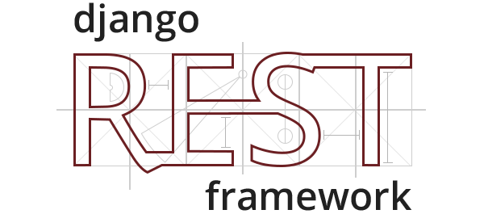

    <iframe src="https://ghbtns.com/github-btn.html?user=encode&amp;repo=django-rest-framework&amp;type=watch&amp;count=true" class="github-star-button" allowtransparency="true" frameborder="0" scrolling="0" width="110px" height="20px"></iframe>

    

    

---

<h1 style="position: absolute;
    width: 1px;
    height: 1px;
    padding: 0;
    margin: -1px;
    overflow: hidden;
    clip: rect(0,0,0,0);
    border: 0;">Django REST Framework</h1>

Django REST framework는 Web API를 구축하기 위한 강력하고 유연한 툴킷입니다.

REST framework를 사용하고 싶어지는 이유는 다음과 같습니다:

* 웹에서 직접 탐색 가능한(browsable) API는 개발자에게 큰 사용성 향상 요소입니다.
* [Authentication policies][authentication] — [OAuth1a][oauth1-section], [OAuth2][oauth2-section] 패키지 포함.
* [Serialization][serializers] — [ORM][modelserializer-section] 데이터 소스와 [non-ORM][serializer-section] 데이터 소스 모두 지원.
* 완전히 커스터마이즈 가능 — 더 [more][generic-views], [powerful][viewsets], [features][routers]이 필요 없다면, [regular function-based views][functionview-section]만 사용해도 됩니다.
* 풍부한 문서와 훌륭한 커뮤니티 지원.
* [Mozilla][mozilla], [Red Hat][redhat], [Heroku][heroku], [Eventbrite][eventbrite] 등 국제적으로 잘 알려진 기업들이 사용하고 신뢰합니다.

---

## Requirements

REST framework는 다음이 필요합니다:

* Django (4.2, 5.0, 5.1, 5.2)
* Python (3.10, 3.11, 3.12, 3.13, 3.14)

우리는 각 Python 및 Django 시리즈의 최신 패치 릴리스 사용을 **강력히 권장하며**, 공식 지원도 최신 패치 버전에 대해서만 제공합니다.

다음 패키지들은 선택 사항입니다:

* [PyYAML][pyyaml], [uritemplate][uriteemplate] (5.1+, 3.0.0+) — 스키마 생성 지원.
* [Markdown][markdown] (3.3.0+) — 브라우저에서 탐색 가능한 API에서 Markdown 지원.
* [Pygments][pygments] (2.7.0+) — Markdown 처리 시 구문 하이라이팅 추가.
* [django-filter][django-filter] (1.0.1+) — 필터링 기능 지원.
* [django-guardian][django-guardian] (1.1.1+) — 객체 단위 권한(Object-level permissions) 지원.

## Installation

`pip`을 사용해 설치합니다. 필요한 선택 패키지가 있다면 함께 설치하세요.

    pip install djangorestframework
    pip install markdown       # 브라우저용 API에서 Markdown 지원
    pip install django-filter  # 필터링 기능 지원

...또는 GitHub에서 프로젝트를 직접 클론할 수도 있습니다:

    git clone https://github.com/encode/django-rest-framework

`INSTALLED_APPS` 설정에 `'rest_framework'`를 추가하세요:

    INSTALLED_APPS = [
        ...
        'rest_framework',
    ]

브라우저에서 탐색 가능한 API를 사용할 예정이라면, REST framework의 로그인/로그아웃 뷰도 추가하는 것이 좋습니다.
프로젝트의 최상위 `urls.py`에 다음을 추가하세요:

    urlpatterns = [
        ...
        path('api-auth/', include('rest_framework.urls'))
    ]

URL 경로는 원하는 대로 변경해도 괜찮습니다.

## Example

이제 REST framework를 사용해 간단한 모델 기반 API를 만드는 예시를 살펴보겠습니다.

우리 프로젝트의 사용자 정보를 읽고/쓰기 가능한 API를 만들어보겠습니다.

REST framework API에 대한 전역 설정은 REST_FRAMEWORK라는 설정 딕셔너리에 저장됩니다.
settings.py에 다음을 추가하세요:

    REST_FRAMEWORK = {
        # Django의 기본 `django.contrib.auth` 권한 사용,
        # 또는 인증되지 않은 사용자에게 읽기 전용 허용.
        'DEFAULT_PERMISSION_CLASSES': [
            'rest_framework.permissions.DjangoModelPermissionsOrAnonReadOnly'
        ]
    }

그리고 `INSTALLED_APPS`에 `rest_framework`를 추가하는 것 역시 잊지 마세요.

이제 API를 만들 준비가 되었습니다.
다음은 프로젝트의 루트 `urls.py` 예시입니다:

    from django.urls import path, include
    from django.contrib.auth.models import User
    from rest_framework import routers, serializers, viewsets

    # Serializer는 API 표현을 정의합니다.
    class UserSerializer(serializers.HyperlinkedModelSerializer):
        class Meta:
            model = User
            fields = ['url', 'username', 'email', 'is_staff']

    # ViewSet은 뷰의 동작을 정의합니다.
    class UserViewSet(viewsets.ModelViewSet):
        queryset = User.objects.all()
        serializer_class = UserSerializer

    # Router는 URL 설정을 자동으로 결정하는 쉬운 방법을 제공합니다.
    router = routers.DefaultRouter()
    router.register(r'users', UserViewSet)

    # 자동 URL 라우팅을 사용하여 우리의 API를 연결합니다.
    # 추가로, 브라우저에서 사용하는 API 로그인 URL도 포함합니다.
    urlpatterns = [
        path('', include(router.urls)),
        path('api-auth/', include('rest_framework.urls', namespace='rest_framework'))
    ]

브라우저에서 [http://127.0.0.1:8000/](http://127.0.0.1:8000/)을 열면 새로 생성된 ‘users’ API를 확인할 수 있습니다.
오른쪽 상단의 로그인 기능을 사용하면 사용자 추가, 생성, 삭제까지 가능해집니다.

## Quickstart

지금 바로 시작하고 싶나요? [quickstart guide][quickstart]는 REST framework로 API를 만들고 실행하는 가장 빠른 방법입니다.

## Development

저장소를 클론하고 테스트를 실행하며 REST Framework 코드베이스 유지에 기여하는 방법은
[Contribution guidelines][contributing] 문서를 참조하세요.

## Support

지원이 필요하다면 [REST framework discussion group][group]을 참고하거나, irc.libera.chat의 #restframework 채널을 이용해 보세요. 또는 [Stack Overflow][stack-overflow]에 질문을 올릴 수 있으며, 이때 [‘django-rest-framework’][django-rest-framework-tag] 태그를 꼭 포함해 주세요.

## Security

**보안 이슈는 <security@encode.io> 로 이메일을 보내 보고해 주세요.**

프로젝트 관리자들이 공개되기 전에 필요한 조치를 함께 진행합니다.

## License

Copyright © 2011-present, [Encode OSS Ltd](https://www.encode.io/).
All rights reserved.

소스 및 바이너리 형태로 재배포·사용은 아래 조건을 충족하는 경우 허용됩니다:

* 소스 코드 재배포 시 위 저작권 공지, 조건 목록, 면책 조항을 포함해야 합니다.
* 바이너리 재배포 시 문서 및 기타 자료에 위 저작권 공지·조건 목록·면책 조항을 포함해야 합니다.
* 저작권자 또는 기여자의 이름을 그들의 사전 서면 허가 없이 파생 소프트웨어의 홍보에 사용할 수 없습니다.

이 소프트웨어는 “있는 그대로(AS IS)” 제공되며,
명시적 또는 묵시적인 상업성·특정 목적 적합성 보증을 포함해
일체의 보증을 제공하지 않습니다.

저작권자 또는 기여자는 소프트웨어 사용으로 발생하는
직접적·간접적·특별·우발·결과적 손해에 대해 책임을 지지 않습니다.

[mozilla]: https://www.mozilla.org/en-US/about/
[redhat]: https://www.redhat.com/
[heroku]: https://www.heroku.com/
[eventbrite]: https://www.eventbrite.co.uk/about/
[pyyaml]: https://pypi.org/project/PyYAML/
[uriteemplate]: https://pypi.org/project/uritemplate/
[markdown]: https://pypi.org/project/Markdown/
[pygments]: https://pypi.org/project/Pygments/
[django-filter]: https://pypi.org/project/django-filter/
[django-guardian]: https://github.com/django-guardian/django-guardian
[oauth1-section]: api-guide/authentication/#django-rest-framework-oauth
[oauth2-section]: api-guide/authentication/#django-oauth-toolkit
[serializer-section]: api-guide/serializers#serializers
[modelserializer-section]: api-guide/serializers#modelserializer
[functionview-section]: api-guide/views#function-based-views

[quickstart]: tutorial/quickstart.md

[generic-views]: api-guide/generic-views.md
[viewsets]: api-guide/viewsets.md
[routers]: api-guide/routers.md
[serializers]: api-guide/serializers.md
[authentication]: api-guide/authentication.md

[contributing]: community/contributing.md

[group]: https://groups.google.com/forum/?fromgroups#!forum/django-rest-framework
[stack-overflow]: https://stackoverflow.com/
[django-rest-framework-tag]: https://stackoverflow.com/questions/tagged/django-rest-framework
